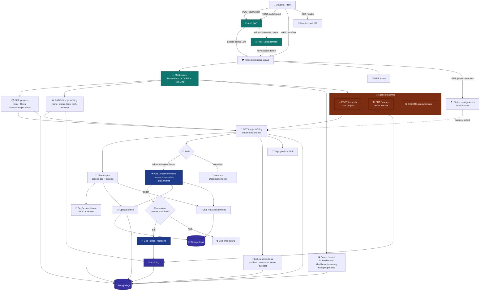

<div align="center">


<br /><br />

# Atlas Knowledge API

**API REST em Go** para a wiki corporativa **Atlas Knowledge** — projetos, seções, lições, anexos e busca.

<br />

[](https://go.dev/)
[](https://echo.labstack.com/)
[](https://www.postgresql.org/)
[](https://jwt.io/)
[](http://localhost:8080/swagger)

<br />

[Início rápido](#-início-rápido) ·
[Swagger](#-swagger-ui) ·
[Rotas](#-rotas-apiv1) ·
[Documentação IA](#-documentação-com-ia-mnemos) ·
[Integração Mnemos](#-integração-mnemos-apiv1mnemos) ·
[Variáveis](#-variáveis-de-ambiente)

</div>

---

## Sobre

Backend da plataforma de conhecimento interno. Oferece autenticação JWT, CRUD de projetos com permissões por perfil, seções em árvore (abas **Projeto** e **Desenvolvimento**), lições aprendidas, upload de arquivos, **geração de documentação via Mnemos (IA)** e documentação interativa via Swagger UI.

**Perfis de acesso:** `admin`, `consultor` e `desenvolvedor`. A aba **Desenvolvimento** (seções e anexos técnicos) só é visível para `admin` e `desenvolvedor`; a edição fica restrita a `admin` e aos dev-responsáveis do projeto.

### Fluxo principal



<table>
<tr>
<td width="60" align="center"></td>
<td><b>Go</b> — linguagem principal, binários rápidos e tipagem forte</td>
</tr>
<tr>
<td align="center"></td>
<td><b>PostgreSQL</b> — persistência relacional com migrations versionadas</td>
</tr>
<tr>
<td align="center"></td>
<td><b>Echo</b> — framework HTTP leve, middleware e rotas REST</td>
</tr>
<tr>
<td align="center"></td>
<td><b>OpenAPI / Swagger</b> — contrato da API e testes no navegador</td>
</tr>
<tr>
<td align="center"></td>
<td><b>pgx + golang-migrate</b> — driver Postgres e evolução do schema</td>
</tr>
</table>

---

## Pré-requisitos

| | Requisito | Versão |
|---|-----------|--------|
|  | **Go** | 1.22+ (recomendado 1.24+) |
|  | **PostgreSQL** | 15+ instalado localmente |
|  | **Make** *(opcional)* | Linux / macOS — no Windows use `dev.ps1` |

---

## Configuração

### 1. Variáveis de ambiente

```powershell
copy .env.example .env
```

Ajuste `DATABASE_URL` no `.env` com usuário, senha e porta do seu Postgres local (padrão: `5432`).

### 2. Criar o banco

No `psql` ou pgAdmin:

```sql
CREATE DATABASE atlas_knowledge;
```

---

## Início rápido

<table>
<tr>
<td width="44%" align="center" valign="middle">


</td>
<td width="56%" valign="top">

### Windows (PowerShell)

```powershell
# Opção A — tudo de uma vez (cria .env, migrate e sobe a API)
.\dev.ps1

# Opção B — passo a passo
go run ./cmd/migrate up
go run ./cmd/create-admin -email seu@email.com -password SUA_SENHA
go run ./cmd/api

# Só a API, sem migrate
.\dev.ps1 -ApiOnly
```

### Linux / macOS

```bash
cp .env.example .env
make migrate-up
make create-admin EMAIL=seu@email.com PASSWORD=SUA_SENHA NAME=Administrador
make run
```

> O primeiro admin só pode ser criado em banco **vazio** (sem usuários cadastrados).

</td>
</tr>
</table>

---

## Variáveis de ambiente

| Variável | Descrição | Padrão |
|----------|-----------|--------|
| `PORT` | Porta HTTP | `8080` |
| `DATABASE_URL` | Connection string Postgres local | ver `.env.example` |
| `JWT_SECRET` | Segredo HS256 | `change-me-in-production` |
| `JWT_ACCESS_TTL` | Expiração access token | `15m` |
| `JWT_REFRESH_TTL` | Expiração refresh token | `168h` |
| `STORAGE_PATH` | Pasta de uploads locais | `./storage` |
| `MAX_UPLOAD_BYTES` | Tamanho máximo upload | `20971520` (20 MB) |
| `CORS_ORIGINS` | Origens permitidas (vírgula) | `http://localhost:5173` |
| `API_BASE_URL` | URL base usada em links de download de anexos | `http://localhost:{PORT}` |
| `AI_SERVICE_URL` | Base URL do Mnemos | `http://localhost:8081` |
| `AI_SERVICE_TIMEOUT` | Timeout ao aguardar o job de IA (polling até completar) | `30m` |
| `DOC_MAX_FILES` | Máximo de arquivos por geração | `20` |
| `DOC_MAX_FILE_BYTES` | Tamanho máximo por arquivo na geração | `20971520` (20 MB) |
| `DOC_MAX_TOTAL_BYTES` | Tamanho total máximo dos arquivos na geração | `104857600` (100 MB) |
| `MNEMOS_API_KEY` | Chave para o Mnemos chamar `/api/v1/mnemos/*` (`X-Api-Key`) | *(vazio)* |
| `ADMIN_EMAIL` / `ADMIN_PASSWORD` / `ADMIN_NAME` | Bootstrap do primeiro admin (banco vazio) | ver `.env.example` |

Nas rotas `/mnemos/*` autenticadas por `X-Api-Key`, o responsável/ator é o **usuário logado no front** (`responsibleUserId` / `X-Actor-User-Id`), não o `ADMIN_EMAIL`.

**Datas JSON:** campos de data usam formato `YYYY-MM-DD` (ISO 8601, apenas data).

---

## Swagger UI

Com a API rodando, abra no navegador:

### [http://localhost:8080/swagger](http://localhost:8080/swagger)

| Passo | Ação |
|-------|------|
| 1 | Teste o health check: `GET /api/v1/health` (sem login) |
| 2 | Faça login em `POST /api/v1/auth/login` com o admin criado |
| 3 | Copie o `accessToken`, clique em **Authorize** e informe: `Bearer SEU_TOKEN` |
| 4 | Explore e teste as demais rotas |

A especificação OpenAPI também está em `GET /openapi.yaml`.

---

## Rotas (`/api/v1`)

| Método | Rota | Auth |
|--------|------|------|
| `POST` | `/auth/login` | — |
| `POST` | `/auth/refresh` | cookie |
| `POST` | `/auth/logout` | JWT |
| `GET` | `/auth/me` | JWT |
| `GET` | `/users` | JWT |
| `GET` | `/dashboard/summary` | JWT |
| `GET` | `/search?q=` | JWT |
| `GET` | `/project-statuses` | JWT |
| `GET` | `/projects` | JWT |
| `GET` | `/projects/:slug` | JWT |
| `POST` | `/projects` | JWT (admin) |
| `PATCH` | `/projects/:slug` | JWT |
| `DELETE` | `/projects/:slug` | JWT (admin) |
| `PUT` | `/projects/:slug/readers` | JWT |
| `POST` / `PATCH` / `DELETE` | `/projects/:slug/sections...` | JWT |
| `PUT` | `/projects/:slug/sections/reorder` | JWT |
| `POST` / `PATCH` / `DELETE` | `/projects/:slug/dev-sections...` | JWT (admin / dev) |
| `PUT` | `/projects/:slug/dev-sections/reorder` | JWT (admin / dev) |
| `POST` / `PATCH` / `DELETE` | `/projects/:slug/lessons...` | JWT |
| `POST` / `DELETE` | `/projects/:slug/attachments...` | JWT |
| `POST` / `DELETE` | `/projects/:slug/dev-attachments...` | JWT (admin / dev) |
| `GET` | `/files/:fileId/download` | JWT |
| `POST` | `/projects/:slug/documentation/generate` | JWT |
| `GET` | `/projects/:slug/documentation` | JWT |
| `GET` | `/projects/:slug/documentation/versions` | JWT |
| `GET` / `DELETE` | `/projects/:slug/documentation/:versionId` | JWT |
| `POST` | `/projects/:slug/documentation/:versionId/regenerate` | JWT |
| `GET` | `/documentation/jobs` | JWT |
| `GET` | `/documentation/jobs/:jobId` | JWT |
| `POST` | `/documentation/jobs/:jobId/cancel` | JWT |
| `POST` | `/mnemos/projects` | JWT admin ou `X-Api-Key` |
| `PATCH` | `/mnemos/projects/:slug` | JWT admin ou `X-Api-Key` |
| `PUT` | `/mnemos/projects/:slug/structure` | JWT admin ou `X-Api-Key` |
| `POST` | `/mnemos/projects/:slug/attachments` | JWT admin ou `X-Api-Key` |

---

## Documentação com IA (Mnemos)

A Atlas **orquestra** a geração: valida permissões, armazena arquivos, cria um job local, envia ao Mnemos e persiste o resultado em versões. A inteligência artificial roda só no serviço Mnemos.

```text
Front (usuário logado)
  → POST /api/v1/projects/:slug/documentation/generate
  → Atlas valida + salva arquivos + cria job
  → POST {AI_SERVICE_URL}/v1/knowledge/document
       (files + project_id/name/description + responsible_user_id)
  → polling GET {AI_SERVICE_URL}/v1/jobs/:id
  → persiste documentation_versions
```

Se o Mnemos estiver com `ATLAS_SYNC_ENABLED=true`, ele também pode **empurrar** `project` / `sections` / anexos de volta nas rotas `/api/v1/mnemos/*` (ver seção seguinte), atribuindo tudo ao usuário que pediu a geração.

### Gerar documentação

`POST /api/v1/projects/:slug/documentation/generate` — `multipart/form-data`

| Campo | Obrigatório | Descrição |
|-------|-------------|-----------|
| `files` | sim | Um ou mais arquivos fonte |
| `project_name` | não | Sobrescreve o nome enviado à IA |
| `description` | não | Sobrescreve a descrição |
| `generation_options` | não | JSON livre de opções |

Resposta imediata (job assíncrono):

```json
{
  "job_id": "uuid",
  "status": "PENDING",
  "message": "Processamento iniciado."
}
```

Acompanhe com `GET /api/v1/documentation/jobs/:jobId` ou liste ativos em `GET /api/v1/documentation/jobs`.

---

## Integração Mnemos (`/api/v1/mnemos/*`)

Rotas para o Mnemos (ou automação) **criar/atualizar projetos**, aplicar a árvore de seções no formato do `DocumentResult` e anexar arquivos.

### Autenticação

| Modo | Como |
|------|------|
| Integração | Header `X-Api-Key: <MNEMOS_API_KEY>` |
| Admin manual | `Authorization: Bearer <JWT_admin>` |

Com `X-Api-Key`, informe quem pediu no front:

- body/form: `responsibleUserId` (UUID do usuário Atlas), **ou**
- header: `X-Actor-User-Id: <uuid>`

Esse usuário vira responsável do projeto, `uploaded_by` dos arquivos e ator da auditoria.

No fluxo Atlas → Mnemos → Atlas, a Atlas já envia `responsible_user_id` / `requested_by` = `created_by` do job; o Mnemos devolve nos syncs. O front **não precisa** chamar `/mnemos/*` se usar só `documentation/generate`.

### Rotas

#### `POST /api/v1/mnemos/projects`

Cria (201) ou atualiza (200) projeto + seções (payload alinhado ao Mnemos).

```json
{
  "project": {
    "name": "Meu Sistema",
    "slug": "meu-sistema",
    "description": "...",
    "status": "active",
    "client": "Cliente X"
  },
  "sections": [
    {
      "temp_id": "s1",
      "parent_temp_id": "",
      "title": "Visão geral",
      "content": "## Contexto\n...",
      "kind": "doc",
      "sort_order": 0
    }
  ],
  "replaceSections": true,
  "responsibleUserId": "uuid-do-usuario-logado"
}
```

| Campo seções | Significado |
|--------------|-------------|
| `temp_id` | ID estável no JSON (antes do UUID do banco) |
| `parent_temp_id` | Pai na árvore; vazio = raiz |
| `kind` | `doc` (aba Projeto) ou `dev` (aba Desenvolvimento) |
| `content` | Markdown |
| `replaceSections` | `true` (padrão): substitui a árvore; `false`: só acrescenta |

#### `PATCH /api/v1/mnemos/projects/:slug`

Atualiza metadados (`name`, `description`, `status`, `client`, `responsibleUserId`) sem mexer nas seções.

#### `PUT /api/v1/mnemos/projects/:slug/structure`

Aplica/substitui só a árvore `sections[]` (mesmo formato acima).

#### `POST /api/v1/mnemos/projects/:slug/attachments`

Multipart: campo `files` (ou `file`) + opcional `meta` (JSON com `attachments[]` do Mnemos) + `responsibleUserId`.

```bash
curl -X POST http://localhost:8080/api/v1/mnemos/projects/meu-sistema/attachments \
  -H "X-Api-Key: SUA_CHAVE" \
  -H "X-Actor-User-Id: UUID_DO_USUARIO" \
  -F "files=@spec.pdf" \
  -F 'meta=[{"source_filename":"spec.pdf","display_name":"Especificação","kind":"project"}]'
```

`kind` do anexo: `project` | `dev`.

### Configuração no Mnemos (serviço de IA)

No `.env` do Mnemos (exemplo):

```env
ATLAS_BASE_URL=http://localhost:8080
ATLAS_API_KEY=mesma-chave-de-MNEMOS_API_KEY
ATLAS_SYNC_ENABLED=true
ATLAS_REPLACE_SECTIONS=true
```

A chave deve ser **igual** a `MNEMOS_API_KEY` na Atlas.

---

## Exemplos curl

```bash
# Login
curl -c cookies.txt -X POST http://localhost:8080/api/v1/auth/login \
  -H "Content-Type: application/json" \
  -d '{"email":"seu@email.com","password":"SUA_SENHA"}'

# Listar projetos
curl http://localhost:8080/api/v1/projects \
  -H "Authorization: Bearer SEU_ACCESS_TOKEN"

# Criar projeto (admin)
curl -X POST http://localhost:8080/api/v1/projects \
  -H "Authorization: Bearer SEU_ACCESS_TOKEN" \
  -H "Content-Type: application/json" \
  -d '{"slug":"meu-projeto","name":"Meu Projeto","description":"Descrição"}'

# Sync Mnemos → Atlas (projeto + seções)
curl -X POST http://localhost:8080/api/v1/mnemos/projects \
  -H "X-Api-Key: SUA_MNEMOS_API_KEY" \
  -H "Content-Type: application/json" \
  -d '{
    "project": {"name":"Meu Sistema","slug":"meu-sistema","description":"via Mnemos","status":"active"},
    "sections": [{"temp_id":"s1","parent_temp_id":"","title":"Visão geral","content":"...","kind":"doc","sort_order":0}],
    "replaceSections": true,
    "responsibleUserId": "UUID_DO_USUARIO_LOGADO"
  }'
```

---

## Banco com dados antigos (Docker / seed)

Se você usou o seed anterior ou o Postgres via Docker, limpe o banco antes de usar só dados reais:

```sql
DROP DATABASE atlas_knowledge;
CREATE DATABASE atlas_knowledge;
```

Depois rode:

```bash
go run ./cmd/migrate up
go run ./cmd/create-admin -email seu@email.com -password SUA_SENHA
```

---

## Etapa atual

> **Em andamento:** orquestração de documentação com IA (Mnemos) + rotas de sync para persistir estrutura de projeto.

### O que foi feito até agora

**Perfis e permissões**

- Perfis migrados de `admin`/`user` para **`admin`**, **`consultor`** e **`desenvolvedor`** (migration `000002`).
- Aba **Desenvolvimento** visível apenas para `admin` e `desenvolvedor`; `consultor` recebe listas vazias.
- Edição da aba Desenvolvimento restrita a `admin` e aos **dev-responsáveis** do projeto (tabela `project_dev_responsibles`).

**Seções e anexos por aba**

- `section_kind` (`doc` / `dev`) separa seções de documentação (aba Projeto) das de requisitos técnicos (aba Desenvolvimento).
- `attachment_kind` (`project` / `dev`) separa os anexos de cada aba.
- Rotas espelhadas: `dev-sections...` e `dev-attachments...` (incluindo `reorder`).

**Status de projeto configuráveis**

- Tabela **`project_statuses`** como fonte de verdade (migrations `000004` e `000005`): `label`, `color` e `background`.
- Status: `active`, `paused`, `done`, `cancelled`.
- Rota `GET /project-statuses`.

**Documentação com IA (Mnemos)**

- Cliente HTTP em `internal/ai` → `POST /v1/knowledge/document` + polling `GET /v1/jobs/:id`.
- Jobs e versões: migration `000006` (`documentation_jobs`, `documentation_versions`, `documentation_files`).
- Rotas de geração, listagem de versões, cancelamento de jobs.
- Atlas envia `responsible_user_id` / `requested_by` = usuário que disparou a geração.

**Integração de volta (`/api/v1/mnemos/*`)**

- Upsert de projeto + árvore de seções (`temp_id` / `parent_temp_id`, `kind` doc|dev).
- Upload de anexos com meta no formato Mnemos (`source_filename`, `kind` project|dev).
- Auth: `X-Api-Key` (`MNEMOS_API_KEY`) ou JWT admin.
- Ator/responsável = usuário do front (`responsibleUserId` / `X-Actor-User-Id`), não o admin da chave.

**Projetos / busca / dashboard**

- Criação/edição com `devResponsibleUserIds`, `client`, `tags` e `tech`.
- Filtro por período na busca e no dashboard; downloads com `API_BASE_URL`.

### Migrations desta etapa

| # | Migration | Conteúdo |
|---|-----------|----------|
| `000002` | `roles_and_dev` | Perfis, `section_kind`, dev-responsáveis |
| `000003` | `dev_attachments` | `attachment_kind` para anexos por aba |
| `000004` | `project_status_cancelled` | Status `cancelled` |
| `000005` | `project_statuses_table` | Tabela `project_statuses` |
| `000006` | `documentation_generation` | Jobs, versões e arquivos de documentação IA |

### Próximos passos

- Ajustes finos de UX no gerador de documentação no front.
- Tabela de citações (`citations`) quando o contrato Atlas/Mnemos evoluir.
- Feedback de sync (`atlas_sync`) na UI de jobs.

---

<br />

<div align="center">

<sub>Feito com Go · Atlas Knowledge API</sub>

</div>
