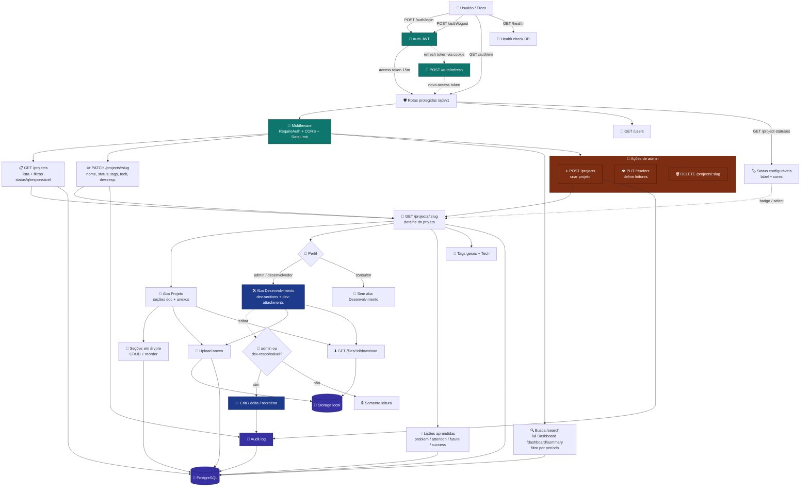

<div align="center">


<br /><br />

# Atlas Knowledge API

**API REST em Go** para a wiki corporativa **Atlas Knowledge** — projetos, seções, lições, anexos e busca.

<br />

[](https://go.dev/)
[](https://echo.labstack.com/)
[](https://www.postgresql.org/)
[](https://jwt.io/)
[](http://localhost:8080/swagger)

<br />

[Início rápido](#-início-rápido) ·
[Swagger](#-swagger-ui) ·
[Rotas](#-rotas-apiv1) ·
[Variáveis](#-variáveis-de-ambiente)

</div>

---

## Sobre

Backend da plataforma de conhecimento interno. Oferece autenticação JWT, CRUD de projetos com permissões por perfil, seções em árvore (abas **Projeto** e **Desenvolvimento**), lições aprendidas, upload de arquivos e documentação interativa via Swagger UI.

**Perfis de acesso:** `admin`, `consultor` e `desenvolvedor`. A aba **Desenvolvimento** (seções e anexos técnicos) só é visível para `admin` e `desenvolvedor`; a edição fica restrita a `admin` e aos dev-responsáveis do projeto.

### Fluxo principal



<table>
<tr>
<td width="60" align="center"></td>
<td><b>Go</b> — linguagem principal, binários rápidos e tipagem forte</td>
</tr>
<tr>
<td align="center"></td>
<td><b>PostgreSQL</b> — persistência relacional com migrations versionadas</td>
</tr>
<tr>
<td align="center"></td>
<td><b>Echo</b> — framework HTTP leve, middleware e rotas REST</td>
</tr>
<tr>
<td align="center"></td>
<td><b>OpenAPI / Swagger</b> — contrato da API e testes no navegador</td>
</tr>
<tr>
<td align="center"></td>
<td><b>pgx + golang-migrate</b> — driver Postgres e evolução do schema</td>
</tr>
</table>

---

## Pré-requisitos

| | Requisito | Versão |
|---|-----------|--------|
|  | **Go** | 1.22+ (recomendado 1.24+) |
|  | **PostgreSQL** | 15+ instalado localmente |
|  | **Make** *(opcional)* | Linux / macOS — no Windows use `dev.ps1` |

---

## Configuração

### 1. Variáveis de ambiente

```powershell
copy .env.example .env
```

Ajuste `DATABASE_URL` no `.env` com usuário, senha e porta do seu Postgres local (padrão: `5432`).

### 2. Criar o banco

No `psql` ou pgAdmin:

```sql
CREATE DATABASE atlas_knowledge;
```

---

## Início rápido

<table>
<tr>
<td width="44%" align="center" valign="middle">


</td>
<td width="56%" valign="top">

### Windows (PowerShell)

```powershell
# Opção A — tudo de uma vez (cria .env, migrate e sobe a API)
.\dev.ps1

# Opção B — passo a passo
go run ./cmd/migrate up
go run ./cmd/create-admin -email seu@email.com -password SUA_SENHA
go run ./cmd/api

# Só a API, sem migrate
.\dev.ps1 -ApiOnly
```

### Linux / macOS

```bash
cp .env.example .env
make migrate-up
make create-admin EMAIL=seu@email.com PASSWORD=SUA_SENHA NAME=Administrador
make run
```

> O primeiro admin só pode ser criado em banco **vazio** (sem usuários cadastrados).

</td>
</tr>
</table>

---

## Variáveis de ambiente

| Variável | Descrição | Padrão |
|----------|-----------|--------|
| `PORT` | Porta HTTP | `8080` |
| `DATABASE_URL` | Connection string Postgres local | ver `.env.example` |
| `JWT_SECRET` | Segredo HS256 | `change-me-in-production` |
| `JWT_ACCESS_TTL` | Expiração access token | `15m` |
| `JWT_REFRESH_TTL` | Expiração refresh token | `168h` |
| `STORAGE_PATH` | Pasta de uploads locais | `./storage` |
| `MAX_UPLOAD_BYTES` | Tamanho máximo upload | `20971520` (20 MB) |
| `CORS_ORIGINS` | Origens permitidas (vírgula) | `http://localhost:5173` |
| `API_BASE_URL` | URL base usada em links de download de anexos | `http://localhost:{PORT}` |

**Datas JSON:** campos de data usam formato `YYYY-MM-DD` (ISO 8601, apenas data).

---

## Swagger UI

Com a API rodando, abra no navegador:

### [http://localhost:8080/swagger](http://localhost:8080/swagger)

| Passo | Ação |
|-------|------|
| 1 | Teste o health check: `GET /api/v1/health` (sem login) |
| 2 | Faça login em `POST /api/v1/auth/login` com o admin criado |
| 3 | Copie o `accessToken`, clique em **Authorize** e informe: `Bearer SEU_TOKEN` |
| 4 | Explore e teste as demais rotas |

A especificação OpenAPI também está em `GET /openapi.yaml`.

---

## Rotas (`/api/v1`)

| Método | Rota | Auth |
|--------|------|------|
| `POST` | `/auth/login` | — |
| `POST` | `/auth/refresh` | cookie |
| `POST` | `/auth/logout` | JWT |
| `GET` | `/auth/me` | JWT |
| `GET` | `/users` | JWT |
| `GET` | `/dashboard/summary` | JWT |
| `GET` | `/search?q=` | JWT |
| `GET` | `/project-statuses` | JWT |
| `GET` | `/projects` | JWT |
| `GET` | `/projects/:slug` | JWT |
| `POST` | `/projects` | JWT (admin) |
| `PATCH` | `/projects/:slug` | JWT |
| `DELETE` | `/projects/:slug` | JWT (admin) |
| `PUT` | `/projects/:slug/readers` | JWT |
| `POST` / `PATCH` / `DELETE` | `/projects/:slug/sections...` | JWT |
| `PUT` | `/projects/:slug/sections/reorder` | JWT |
| `POST` / `PATCH` / `DELETE` | `/projects/:slug/dev-sections...` | JWT (admin / dev) |
| `PUT` | `/projects/:slug/dev-sections/reorder` | JWT (admin / dev) |
| `POST` / `PATCH` / `DELETE` | `/projects/:slug/lessons...` | JWT |
| `POST` / `DELETE` | `/projects/:slug/attachments...` | JWT |
| `POST` / `DELETE` | `/projects/:slug/dev-attachments...` | JWT (admin / dev) |
| `GET` | `/files/:fileId/download` | JWT |

---

## Exemplos curl

```bash
# Login
curl -c cookies.txt -X POST http://localhost:8080/api/v1/auth/login \
  -H "Content-Type: application/json" \
  -d '{"email":"seu@email.com","password":"SUA_SENHA"}'

# Listar projetos
curl http://localhost:8080/api/v1/projects \
  -H "Authorization: Bearer SEU_ACCESS_TOKEN"

# Criar projeto (admin)
curl -X POST http://localhost:8080/api/v1/projects \
  -H "Authorization: Bearer SEU_ACCESS_TOKEN" \
  -H "Content-Type: application/json" \
  -d '{"slug":"meu-projeto","name":"Meu Projeto","description":"Descrição"}'
```

---

## Banco com dados antigos (Docker / seed)

Se você usou o seed anterior ou o Postgres via Docker, limpe o banco antes de usar só dados reais:

```sql
DROP DATABASE atlas_knowledge;
CREATE DATABASE atlas_knowledge;
```

Depois rode:

```bash
go run ./cmd/migrate up
go run ./cmd/create-admin -email seu@email.com -password SUA_SENHA
```

---

## Etapa atual

> **Em andamento:** backend da tela de projeto com aba de **Desenvolvimento** e status configuráveis.

A etapa atual entrega o suporte de back-end para a nova tela de projeto do front, separando o conteúdo em duas abas (**Projeto** e **Desenvolvimento**) com permissões por perfil, além de tornar os status de projeto configuráveis via banco.

### O que foi feito até agora

**Perfis e permissões**

- Perfis migrados de `admin`/`user` para **`admin`**, **`consultor`** e **`desenvolvedor`** (migration `000002`).
- Aba **Desenvolvimento** visível apenas para `admin` e `desenvolvedor`; `consultor` recebe listas vazias.
- Edição da aba Desenvolvimento restrita a `admin` e aos **dev-responsáveis** do projeto (tabela `project_dev_responsibles`).

**Seções e anexos por aba**

- `section_kind` (`doc` / `dev`) separa seções de documentação (aba Projeto) das de requisitos técnicos (aba Desenvolvimento).
- `attachment_kind` (`project` / `dev`) separa os anexos de cada aba.
- Rotas espelhadas: `dev-sections...` e `dev-attachments...` (incluindo `reorder`).

**Status de projeto configuráveis**

- Nova tabela **`project_statuses`** como fonte de verdade (migrations `000004` e `000005`): cada status carrega `label`, `color` e `background` para o front renderizar os badges.
- Status disponíveis: `active` (Ativo), `paused` (Pausado), `done` (Concluído) e `cancelled` (Cancelado).
- Adicionar um novo status vira um simples `INSERT`, sem migration de `enum`.
- Nova rota `GET /project-statuses` alimenta o select e os badges do front.

**Projetos**

- Criação/edição aceita `devResponsibleUserIds`, `client`, `tags` e `tech`.
- Detalhe do projeto entrega dados das duas abas conforme o perfil do usuário.

**Busca e dashboard**

- Filtro por período (`DateRange`) na busca e no dashboard.
- Links de download de anexos usam `API_BASE_URL`.

### Migrations desta etapa

| # | Migration | Conteúdo |
|---|-----------|----------|
| `000002` | `roles_and_dev` | Perfis, `section_kind`, dev-responsáveis |
| `000003` | `dev_attachments` | `attachment_kind` para anexos por aba |
| `000004` | `project_status_cancelled` | Status `cancelled` |
| `000005` | `project_statuses_table` | Tabela `project_statuses` como fonte de verdade |

### Próximos passos

- Integração da tela de projeto (aba Desenvolvimento) com o front.
- Ajustes finos de permissão/UX conforme feedback da tela.

---

<br />

<div align="center">

<sub>Feito com Go · Atlas Knowledge API</sub>

</div>
